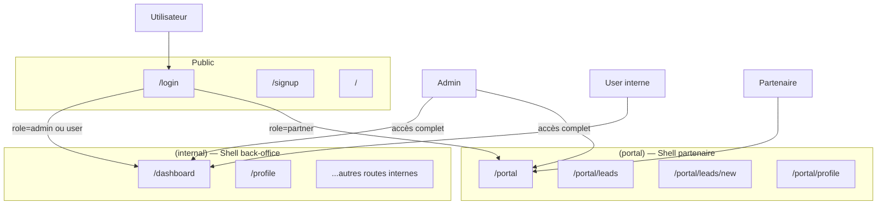

# Template Next.js — Applications internes & portails B2B

Base opinionated pour construire rapidement des **apps internes** (back-office, dashboards, ops) et des **portails partenaires** (apporteurs d'affaires, utilisateurs externes).

---

## Stack

| Couche | Technologie |
|--------|-------------|
| Framework | Next.js (App Router) |
| Auth | NextAuth v5 (credentials + JWT) |
| Base de données | Drizzle ORM + Neon (Postgres serverless) |
| UI | shadcn/ui + Tailwind CSS v4 |
| Tables | TanStack Table |
| Graphiques | Recharts |
| Toasts | Sonner |
| Thème | next-themes |

---

## Architecture — Qui voit quoi



### Rôles

| Rôle | Shell accessible | Description |
|------|-----------------|-------------|
| `admin` | internal + portal | Accès complet |
| `user` | internal | Équipe interne, ops |
| `partner` | portal | Partenaires, apporteurs d'affaires |

---

## Structure du projet

```
app/
  (internal)/           # Shell A — back-office (sidebar dense)
    layout.tsx
    dashboard/page.tsx  # /dashboard
    profile/page.tsx    # /profile
  (portal)/             # Shell B — espace partenaire (sidebar simplifiée)
    layout.tsx
    portal/
      page.tsx          # /portal
      leads/page.tsx    # /portal/leads
  (auth)/               # Login, signup (layout minimal)
    login/
    signup/
  api/
    auth/
    user/

components/
  shell/
    portal-sidebar.tsx  # Sidebar du shell portail
  ui/                   # shadcn primitives
  app-sidebar.tsx       # Sidebar du shell internal
  nav-main.tsx
  nav-user.tsx

lib/
  schema.ts             # Tables Drizzle (users avec role, accounts, sessions)
  authz.ts              # Politiques canAccessInternal / canAccessPortal / isAdmin
  auth.ts
  db.ts

middleware.ts           # Redirections par rôle (commentées par défaut)
```

---

## Démarrer un nouveau projet client

```bash
# 1. Cloner la template
git clone <repo> mon-projet && cd mon-projet

# 2. Installer les dépendances
pnpm install

# 3. Configurer l'environnement
cp .env.example .env
# → remplir DATABASE_URL, NEXTAUTH_SECRET, NEXTAUTH_URL

# 4. Pousser le schéma en base
pnpm db:push

# 5. Lancer en développement
pnpm dev
```

---

## Personnaliser les shells

### Shell interne (`components/app-sidebar.tsx`)

Modifier le tableau `navItems` pour adapter la navigation back-office.

### Shell portail (`components/shell/portal-sidebar.tsx`)

Modifier le tableau `portalNavItems` pour adapter la navigation partenaire.

---

## Activer le RBAC

1. **Ajouter `role` au token JWT** dans `app/api/auth/[...nextauth]/route.ts` :

```ts
callbacks: {
  jwt({ token, user }) {
    if (user) token.role = (user as { role?: string }).role;
    return token;
  },
  session({ session, token }) {
    session.user.role = token.role as string;
    return session;
  },
}
```

2. **Décommenter le bloc RBAC** dans `middleware.ts`.

3. Utiliser `canAccessInternal()` / `canAccessPortal()` de `lib/authz.ts` dans les routes API.

---

## Si le projet est 100 % interne (pas de portail)

Utiliser uniquement le groupe `(internal)` — ignorer `(portal)` et `components/shell/portal-sidebar.tsx`.

---

## Déploiement (Vercel + Neon)

- Créer un projet Vercel, lier le repo.
- Créer une base Neon, copier `DATABASE_URL`.
- Renseigner les variables d'environnement dans Vercel :
  - `DATABASE_URL`
  - `NEXTAUTH_SECRET`
  - `NEXTAUTH_URL` (URL de production)
- Lancer `pnpm db:push` depuis la CI ou manuellement.

---

_Template — mars 2026_
