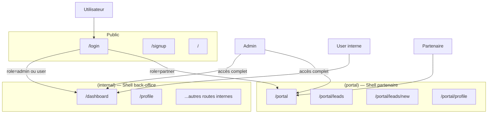

# Template Next.js — Applications internes & portails B2B

Base opinionated pour construire rapidement des **apps internes** (back-office, dashboards, ops) et des **portails partenaires** (apporteurs d'affaires, utilisateurs externes).

---

## Stack

| Couche | Technologie |
|--------|-------------|
| Framework | Next.js (App Router) |
| Auth | NextAuth v5 (credentials + JWT) |
| Base de données | Drizzle ORM + Neon (Postgres serverless) |
| UI | shadcn/ui + Tailwind CSS v4 |
| Tables | TanStack Table |
| Graphiques | Recharts |
| Toasts | Sonner |
| Thème | next-themes |

---

## Comptes personnel vs entreprise (workspace)

En plus des **rôles** d’accès aux shells (voir ci‑dessous), la template distingue le **type de compte** :

| Champ (`users`) | Valeur | Rôle métier |
|-----------------|--------|-------------|
| `accountType` | `user` | Compte **personnel** (pas de workspace) |
| `accountType` | `business` | Compte **entreprise**, rattaché à un **workspace** partagé (`workspaceId`) |

- **Inscription** (`/signup`) : choix du type de compte, puis pour l’entreprise création d’un workspace (nom, identifiant `slug`, mot de passe workspace) ou rattachement à un workspace existant. Voir `components/signup-form.tsx` et `app/api/auth/register/route.ts`.
- **Connexion** (`/login`) : un **`ToggleGroup`** shadcn permet d’indiquer si l’utilisateur se connecte en contexte **Personnel** ou **Entreprise**. Cela ne change pas la vérification des identifiants ; si le choix ne correspond pas au `accountType` réel du compte, un **toast** (Sonner) l’indique après succès.
- **Session NextAuth** : le JWT / la session exposent `accountType`, `workspaceId` et **`workspaceName`** (nom du workspace résolu en base à l’auth). Types : `types/next-auth.d.ts`.
- **Affichage** : `lib/account-context.ts` expose **`getAccountContextLabel()`** — nom du workspace pour un compte entreprise, sinon libellés de repli (« Espace entreprise », « Compte personnel »). Utilisé dans les sidebars (`app-sidebar`, `portal-sidebar`), **`NavUser`** (prop `contextSubtitle`), et les pages d’accueil dashboard / portail.

> **Rappel** : `accountType` (personnel / entreprise) et `role` (`admin` / `user` / `partner` — qui voit quel shell) sont **indépendants**.

---

## Architecture — Qui voit quoi



### Rôles (accès aux shells)

| Rôle | Shell accessible | Description |
|------|-----------------|-------------|
| `admin` | internal + portal | Accès complet |
| `user` | internal | Équipe interne, ops |
| `partner` | portal | Partenaires, apporteurs d'affaires |

---

## UI — shadcn/ui

- **Tout nouveau composant UI** doit idéalement venir de **shadcn** (primitives Radix + styles du design system), pas d’équivalents faits à la main dans `components/ui/`.

  ```bash
  pnpm dlx shadcn@latest add <composant>
  ```

- Les composants générés vont dans `components/ui/` ; les alias sont définis dans `components.json`.
- **MCP shadcn (Cursor)** : le fichier `.cursor/mcp.json` enregistre le serveur MCP officiel. Dans Cursor, activer le serveur **shadcn** (réglages MCP) pour parcourir / installer des composants via l’assistant.

Les règles projet dans `.cursor/rules/` rappellent ces conventions (voir section suivante).

---

## Cursor — règles projet

| Fichier | Rôle |
|---------|------|
| `.cursor/rules/ui-shadcn.mdc` | Toujours privilégier shadcn pour l’UI + rappel MCP. |
| `.cursor/rules/accounts-workspaces.mdc` | Comptes personnel / entreprise, workspaces, session, fichiers clés (auth, login, signup, sidebars). |

---

## Structure du projet

```
app/
  (internal)/           # Shell A — back-office (sidebar dense)
    layout.tsx
    dashboard/page.tsx  # /dashboard
    profile/page.tsx    # /profile
  (portal)/             # Shell B — espace partenaire (sidebar simplifiée)
    layout.tsx
    portal/
      page.tsx          # /portal
      leads/page.tsx    # /portal/leads
  login/page.tsx        # /login
  signup/page.tsx       # /signup
  api/
    auth/
    user/

components/
  shell/
    portal-sidebar.tsx  # Sidebar du shell portail
  ui/                   # shadcn primitives (button, card, toggle-group, …)
  app-sidebar.tsx       # Sidebar du shell internal
  login-form.tsx        # Connexion + toggle type de compte (shadcn)
  signup-form.tsx       # Inscription multi-étapes (user / business + workspace)
  nav-main.tsx
  nav-user.tsx          # Menu user (+ contextSubtitle workspace / personnel)

lib/
  schema.ts             # Drizzle : users, workspaces, workspace_members, …
  account-context.ts    # getAccountContextLabel() pour l’UI
  authz.ts              # canAccessInternal / canAccessPortal / isAdmin
  auth.ts
  db.ts

.cursor/
  mcp.json              # Serveur MCP shadcn pour Cursor
  rules/                # Règles IA (UI, comptes / workspaces)

middleware.ts           # Redirections par rôle (commentées par défaut)
```

---

## Démarrer un nouveau projet client

```bash
# 1. Cloner la template
git clone <repo> mon-projet && cd mon-projet

# 2. Installer les dépendances
pnpm install

# 3. Configurer l'environnement
cp .env.example .env
# → remplir DATABASE_URL, NEXTAUTH_SECRET, NEXTAUTH_URL

# 4. Pousser le schéma en base
pnpm db:push

# 5. Lancer en développement
pnpm dev
```

---

## Personnaliser les shells

### Shell interne (`components/app-sidebar.tsx`)

Modifier le tableau `navItems` pour adapter la navigation back-office. Le sous-titre sous le nom de l’app reflète le **contexte compte** (workspace ou personnel) via `getAccountContextLabel`.

### Shell portail (`components/shell/portal-sidebar.tsx`)

Modifier le tableau `portalNavItems` pour adapter la navigation partenaire. Le sous-titre combine le **contexte compte** et « Partenaire » lorsque c’est pertinent.

---

## Activer le RBAC

1. **Ajouter `role` au token JWT** dans `app/api/auth/[...nextauth]/route.ts` :

```ts
callbacks: {
  jwt({ token, user }) {
    if (user) token.role = (user as { role?: string }).role;
    return token;
  },
  session({ session, token }) {
    session.user.role = token.role as string;
    return session;
  },
}
```

2. **Décommenter le bloc RBAC** dans `middleware.ts`.

3. Utiliser `canAccessInternal()` / `canAccessPortal()` de `lib/authz.ts` dans les routes API.

---

## Si le projet est 100 % interne (pas de portail)

Utiliser uniquement le groupe `(internal)` — ignorer `(portal)` et `components/shell/portal-sidebar.tsx`.

---

## Déploiement (Vercel + Neon)

- Créer un projet Vercel, lier le repo.
- Créer une base Neon, copier `DATABASE_URL`.
- Renseigner les variables d'environnement dans Vercel :
  - `DATABASE_URL`
  - `NEXTAUTH_SECRET`
  - `NEXTAUTH_URL` (URL de production)
- Lancer `pnpm db:push` depuis la CI ou manuellement.

---

_Template — mars 2026_
